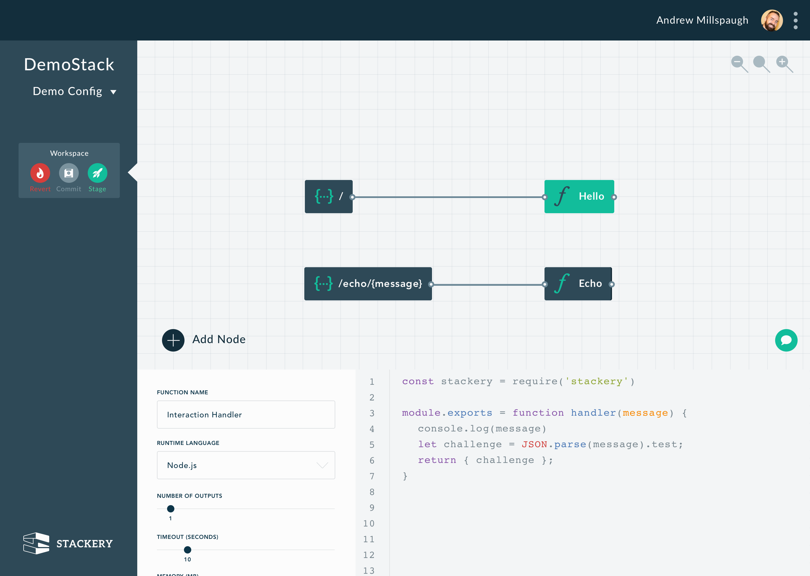
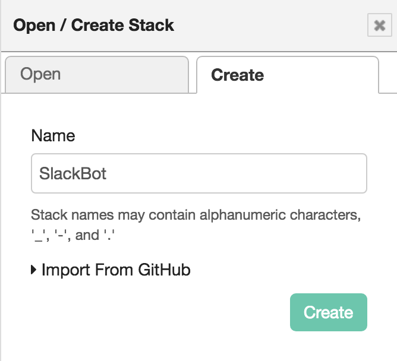
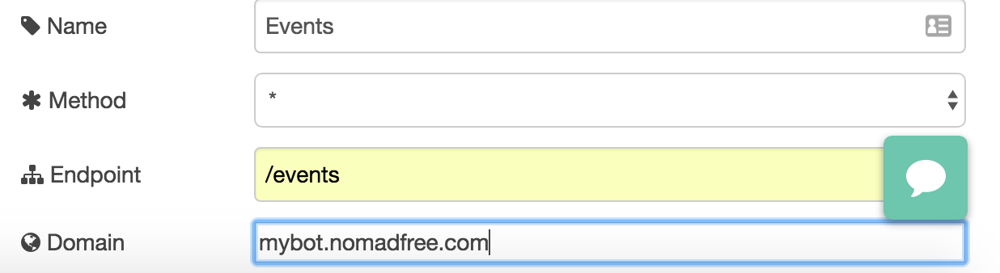
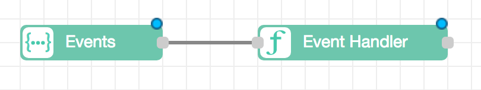

# Build a serverless Slack bot with Stackery

With so many companies now using Slack as their primary means of communication, integrating with Slack is becoming more and more popular. From build reports to taking lunch orders, Slack is often the best way to reach your team. In this tutorial, we'll show you how to build a simple serverless Slack bot utilizing the ease and power of Stackery.

#### Tutorial Requirements

To go through this tutorial, you'll need several services. In addition to Stackery (duh!), you'll need an Amazon Web Services account, a GitHub account, and a Slack team that you can add an app to.

#### Why Serverless?

The term "serverless" refers to cloud provisioning technologies which abstract away the server from the developer and allow the cloud service provider to handle scaling. This enables practically infinite scaling with next to no additional work from the developer. Additionally, billing typically strongly correlates with use, allowing companies with lower use to keep bills low while preserving massive scalability.

Some of the best use cases for serverless technology include:

* Regularly scheduled jobs
* Data ingestion pipelines
* App integrations


#### What is Stackery?

Although serverless computing is simple in concept, it's often quite difficult in execution. The difficulty comes from having to integrate interaction and state into your serverless stack, connecting all of those things together, manging deployment, and monitoring your infrastructure. Stackery brings all of this together in a simple development framework - design, deploy, and monitor your serverless stack without the headache.

#### The Stackery Dashboard

The Stackery dashboard consists of several important components, the most prominent of which being the design canvas. This is the gridded area in the middle of the screen that allows drag and drop design of serverless stacks. In the screenshot below, you'll see a demo stack that has two REST endpoints - one that sends a simple "Hello" message, and another that operates as an echo server.



In addition to the design canvas, you'll also notice that the details for the "Hello" node are pulled up. This is the node detail view and allows you to change important settings as well as edit the code. Though we generally use our own IDEs to edit the code in Stackery nodes, this is a handy way to view or make small changes.

The last major component shown here is the Stack timeline on the left. It shows every committed and deployed stack for this project - as well as the current working version at the very top.

#### Signing up for Stackery 

To sign up for Stackery, first click on the link in your beta invite email. When filling out your information, it's usually handy to set your organization name to be the same as the GitHub organization name that you'll be using.

Once you've made your account and signed in, you'll need to install the Stackery command line tool for your operating system:

On OSX:

```bash
$ curl -Ls https://cli.stackery.io/osx.zip > /tmp/stackery.zip
$ unzip /tmp/stackery.zip -d /usr/local/bin
``` 

On Linux:

```bash
$ curl -Ls https://cli.stackery.io/linux.zip > /tmp/stackery.zip
$ unzip /tmp/stackery.zip -d /usr/local/bin
```

On Windows, download [https://cli.stackery.io/windows.zip](). Unzip it and move stackery.exe to your preferred installation location.

After installing the tool, we'll need provision and link your account to work with Amazon Web Services. For this, you'll need your AWS Secret Key as well as your AWS Access Key. If you've used the AWS CLI before, they're very likely stored in `~/.aws/credentials`, so that's where Stackery will look first.

To go forward, run the following commands:

```bash
stackery login
stackery setup-provider
```

Specifically, this will setup: a new IAM role for Stackery, a S3 bucket for deployment assets, an SNS topic to receive notifications, and a lambda function to forward notifications to Stackery.

#### Deploying your first Stack

After provisoning your account, you'll want to go to `app.stackery.io` and login. You'll be greeted with the demo stack we looked at earlier. You'll notice that Stackery automatically populated the REST nodes with a subdomain just for your use. Usually you'll use your own domain here, but Stackery does this so it's easy to get started.

To deploy, first click on the "Deploy" button in the top righthand corner of the app. You will then be redirected to the deployments page, where you'll be able to see the progress of the AWS changeset being created (this should take about ten seconds).

After creating the changeset, we need to go to AWS to execute it. Next to the new deployment, click on the "View Change Set" button, and you'll be sent to your AWS account. Now click on "Execute" in the top righthand corner, and wait for the deployment (this should take about two minutes).

Congratulations, you've just deployed your first serverless application on Stackery! To test it out, try going to `$YOUR_SUBDOMAIN.stackerystacks.io` and you'll see your greeting!

## The Serverless Slack Bot

Now that we've deployed the demo app, let's get down to some serious business. First, we want to create a new Stack. In order to do that, click on the menu button in the top right, click on `Open/Create Stack`, then `Create` and name your Stack. Name it `SlackBot` or whatever else you feel like!  When you first create the Stack, it will be populated with the demo stack nodes - go ahead and select and delete those (use the delete key).

In order to register our app with Slack, we're going to need a REST endpoint for them to verify. So, to start out, drag a REST node onto the canvas. Name it `Events`, set the endpoint to `/events`, and select whichever subdomain you'd like. You can use the pre-provisioned Stackery subdomain, or you can use any domain that you administer (or any subdomain thereof). If you select a domain that you administer, you'll need to check your email for the permission request after deploying. 

After adding the REST node, drag a Function node to the right of it. Name it `Event Handler` and leave the rest of the settings the same. In the code editor, you'll see the default NodeJS runtime function code - it doesn't do much of anything, but shows you what your code should look like. For right now, we're going to add some code that responds to a challenge from Slack. Copy and paste the following code into your function node editor, and then hit done:

```javascript
const stackery = require('stackery');

module.exports = function handleEvents(data) {
  // The REST node will send the content in a buffer in the body field
  const body = JSON.parse(data.body.toString());
  return body.challenge;
}
```

Now, click on the output of the REST node and drag and drop to connect it to the Function node. The content of your design canvas should look like this:  The small blue dots on the nodes indicate that they contain unsaved content. To save, click on the "Save" button in the top righthand corner of the application. Now, let's deploy our app. Again, click on deploy -> default, then "View Change Set," then execute. Remember, if you used a custom domain, you'll need to check the email associated with that domain in order to enable the certificate. It also may take awhile for the certificate to propagate.

After deploying, we're ready to connect with Slack. Go to [](https://api.slack.com/apps?new_app=1) and make a new app - name it whatever you like. For this app, the only feature we'll need is "Event Subscriptions". Under "Add features and functionality," click on "Event Subscriptions" and then enable. For the request URL, you'll want to enter whatever domain you used on the REST node, including the `/events` endpoint. 


